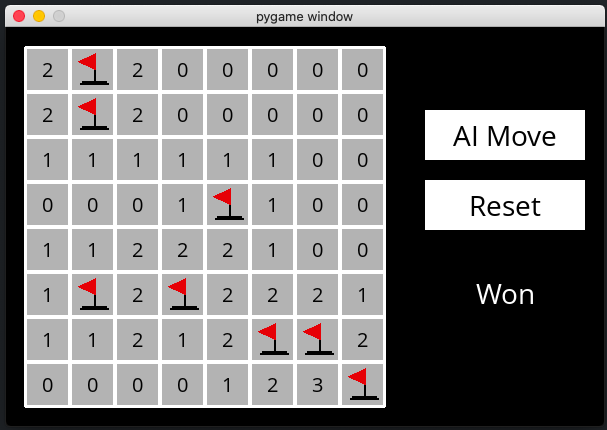

# Writing an AI to play Minesweeper game

Prepared by Afsal BCE 126
___

## Why this activity?
The following activity uses an AI concept called 'Knowledge based agents' which are useful in;
- **Smarter Decisions**: KBAs reason and learn from their knowledge base, leading to better choices and explanations in complex situations. Think expert systems for medical diagnosis or financial advice.
- **Beyond Data**: KBAs go beyond crunching numbers. They understand the world through knowledge, improving tasks like robot navigation, chatbots, and natural language processing.
- **Fighting Bias**: Carefully curated knowledge can counter biases often hidden in data, making AI fairer and more trustworthy.
- **Data Science Boost**: KBAs automate tasks like annotation, feature engineering, and data exploration, saving time and revealing hidden insights in complex datasets.
- **Explainable AI**: KBAs shed light on how AI models reach their conclusions, building trust and understanding between humans and machines.

## Problem Statement
Minesweeper is a puzzle game that consists of a grid of cells, where some of the cells contain hidden “mines.” Clicking on a cell that contains a mine detonates the mine, and causes the user to lose the game. Clicking on a “safe” cell (i.e., a cell that does not contain a mine) reveals a number that indicates how many neighboring cells – where a neighbor is a cell that is one square to the left, right, up, down, or diagonal from the given cell – contain a mine.

## Goal
Your goal in this project will be to build an AI that can play Minesweeper. Recall that knowledge-based agents make decisions by considering their knowledge base, and making inferences based on that knowledge.

## Getting started

- Download the distribution code from https://cdn.cs50.net/ai/2020/x/projects/1/minesweeper.zip and unzip it.
- Create a virtual environment
- Once in the directory for the project, run `pip3 install -r requirements.txt` to install the required Python package (pygame) for this project if you don’t already have it installed.

## Additional References
https://cs50.harvard.edu/ai/2020/projects/1/minesweeper/#minesweeper

