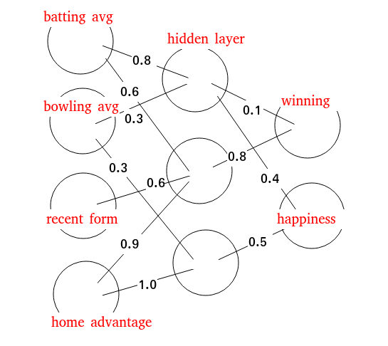

# Deep Learning Basics (prepared by Vishnu Prakash BCE 114)

___
## Why this activity?
- Deeper understanding: Learning from scratch builds an intuitive grasp of deep learning concepts, not just rote memorization.
- Flexibility and innovation: You're not stuck with pre-built solutions, but can customize and evolve models for unique challenges.
- Confidence and troubleshooting: A strong foundation helps diagnose and fix issues, making you a more resourceful deep learner.

## Problem Statement
Create a neural network with the below architecture.

## Getting Started
Create environment
`conda create -n week04 python=3.11`

Activate environment
`conda activate week04`

Install libraries
`pip install -r requirements.txt`
